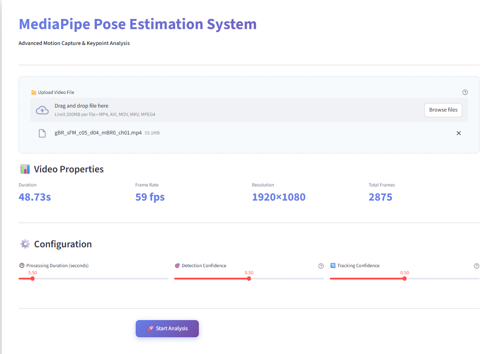
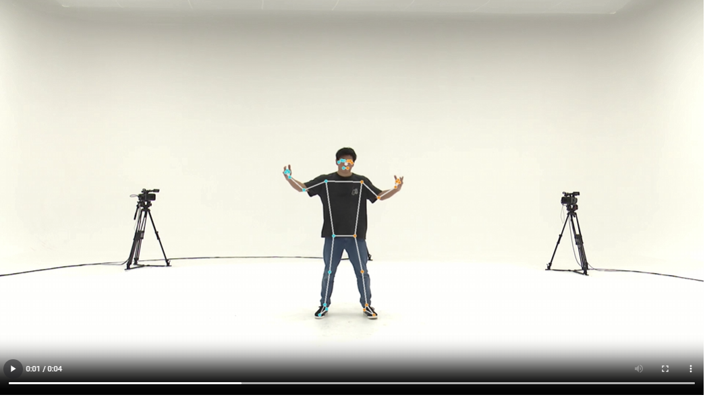
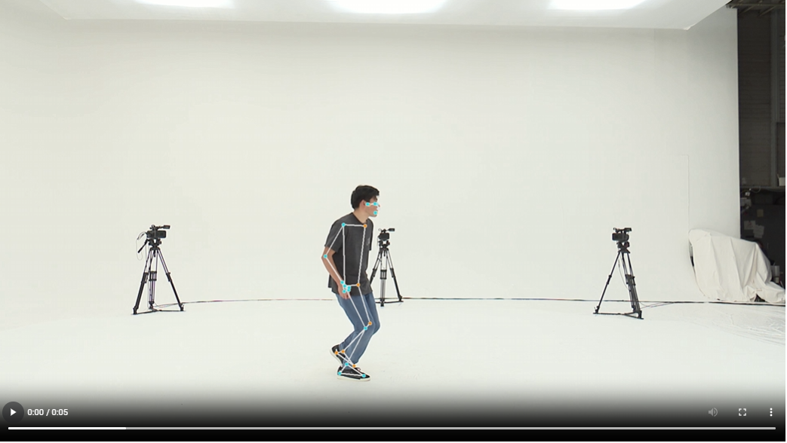
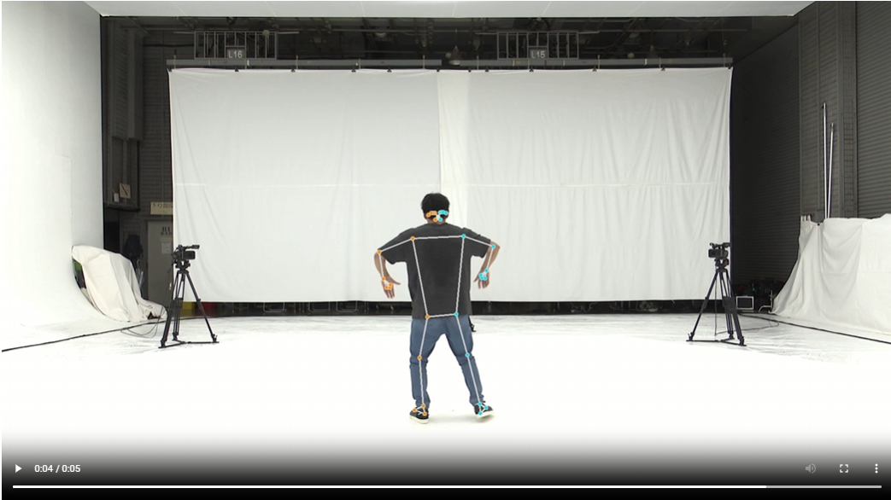

# MediaPipe Pose Estimation System

Advanced pose estimation and keypoint extraction for video analysis.

<p align="center">
  
</p>

## Quick Start

### 1. Install Dependencies
```bash
pip install -r requirements_mediapipe.txt
```

### 2. Launch
**Windows:** Double-click `LAUNCH_APP.bat`  
**Mac/Linux:** Run `./LAUNCH_APP.sh`

### 3. Access
Open browser at `http://localhost:8501`

## Screenshots
<p align="center">    </p>

## Usage

1. Upload video file
2. Set processing duration and confidence thresholds
3. Click "Start Analysis"
4. Download CSV data and annotated video

## Output

All results saved to `outputs/` folder:
- `{video}_mediapipe.csv` - 33 keypoint data per frame
- `{video}_mediapipe_overlay.mp4` - Video with pose overlay

## Configuration

| Setting | Recommended | Description |
|---------|-------------|-------------|
| **Detection Confidence** | 0.4-0.5 | Initial pose detection threshold |
| **Tracking Confidence** | 0.4-0.5 | Frame-to-frame tracking threshold |
| **Duration** | 10s | How many seconds to process |

**Tip:** Higher confidence = fewer false positives, lower confidence = more detections

## CSV Format

Each row contains:
- `frame` - Frame number
- `timestamp` - Time in seconds
- `landmark_N_x/y/z` - 3D coordinates (33 landmarks, 0-32)
- `landmark_N_visibility` - Confidence score per landmark

## Requirements

- Python 3.8+
- 4GB RAM minimum
- Modern web browser

## Notes

You may see OpenCV codec warnings in the terminal - these are normal and don't affect functionality. The system automatically finds a working video codec.

---

**MediaPipe Pose Estimation System** • Powered by Google MediaPipe
